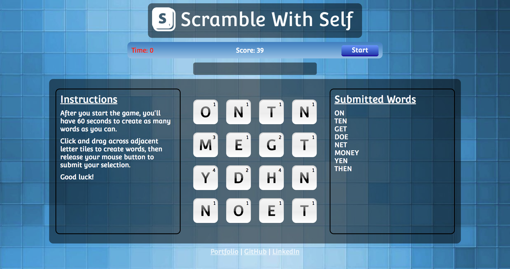

# Scramble With Self

Play the game [here][scramble-with-self]!

[scramble-with-self]: http://www.tamjeffrey.com/scramble-with-self

Scramble With Self is a word jumble game built with JavaScript and jQuery inspired by the game Scramble With Friends.

## How To Play

At the beginning of each round, a 4x4 grid of letters is generated based on the frequencies and letter values of the [Scramble letter distribution][scramble-letter-dist]. Players create words from the board by clicking and dragging their mouse across the letter tiles and then releasing the mouse button to submit their selection. The selections are then checked against the [Official Scrabble Players Dictionary (OSPD)][ospd] and the selected letters momentarily change colors to green, red, or yellow upon submission based on whether the selection is valid, invalid, or valid but previously submitted (respectively). The OSPD word list file was obtained from [The National Puzzlers' League][ospd-word-list].

[scramble-letter-dist]: https://en.wikipedia.org/wiki/Scrabble_letter_distributions
[ospd]: https://en.wikipedia.org/wiki/Official_Scrabble_Players_Dictionary
[ospd-word-list]: http://www.puzzlers.org/dokuwiki/doku.php?id=solving%3awordlists%3aabout%3astart

## Implementation

## Future Work
- [ ] Solve the board: List all possible words and highest possible score at end of round
- [ ] Add styling to show path between selected tiles
